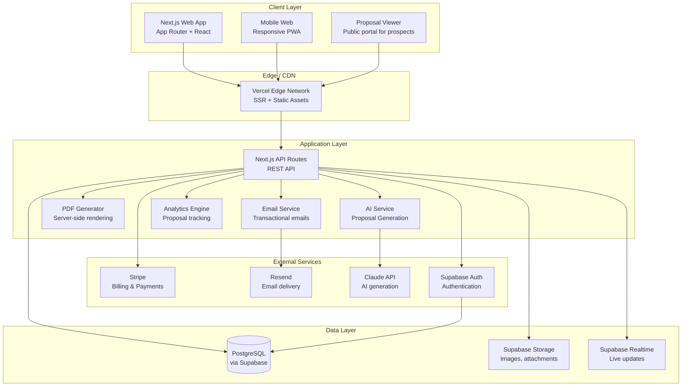
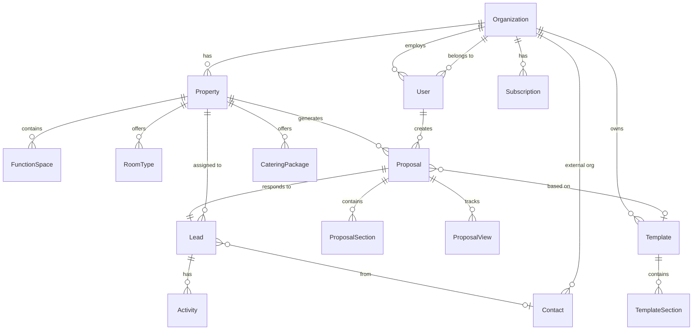
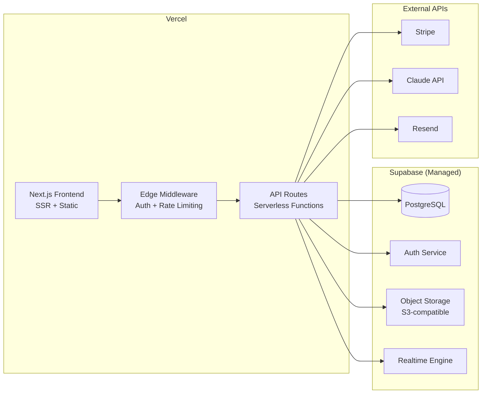

# ProposalForge — System Architecture

## Overview

ProposalForge is an AI-powered group sales proposal platform for hotels. It enables hotel sales teams to create, send, and track interactive MICE/group proposals in minutes instead of hours.

---

## System Architecture Diagram



---

## Data Model

### Entity Relationship Diagram



### Core Entities

#### Organization (Tenant)
```
organization
├── id: uuid (PK)
├── name: text
├── slug: text (unique)
├── logo_url: text
├── brand_colors: jsonb {primary, secondary, accent}
├── domain: text
├── plan: enum (starter, professional, enterprise)
├── stripe_customer_id: text
├── created_at: timestamptz
└── updated_at: timestamptz
```

#### Property
```
property
├── id: uuid (PK)
├── organization_id: uuid (FK → organization)
├── name: text
├── address: jsonb {street, city, state, country, postal_code}
├── coordinates: point
├── description: text
├── star_rating: smallint
├── total_rooms: integer
├── total_meeting_space_sqm: numeric
├── images: jsonb[] {url, caption, category, sort_order}
├── amenities: text[]
├── contact_email: text
├── contact_phone: text
├── timezone: text
├── currency: text (ISO 4217)
├── created_at: timestamptz
└── updated_at: timestamptz
```

#### Room Type
```
room_type
├── id: uuid (PK)
├── property_id: uuid (FK → property)
├── name: text
├── description: text
├── max_occupancy: smallint
├── bed_configuration: text
├── size_sqm: numeric
├── rack_rate: numeric
├── group_rate: numeric
├── images: jsonb[]
├── amenities: text[]
├── sort_order: smallint
├── created_at: timestamptz
└── updated_at: timestamptz
```

#### Function Space
```
function_space
├── id: uuid (PK)
├── property_id: uuid (FK → property)
├── name: text
├── description: text
├── size_sqm: numeric
├── max_capacity_theater: integer
├── max_capacity_classroom: integer
├── max_capacity_banquet: integer
├── max_capacity_reception: integer
├── max_capacity_boardroom: integer
├── half_day_rate: numeric
├── full_day_rate: numeric
├── images: jsonb[]
├── av_equipment: text[]
├── floor_plan_url: text
├── sort_order: smallint
├── created_at: timestamptz
└── updated_at: timestamptz
```

#### Catering Package
```
catering_package
├── id: uuid (PK)
├── property_id: uuid (FK → property)
├── name: text
├── description: text
├── type: enum (breakfast, lunch, dinner, coffee_break, reception, custom)
├── price_per_person: numeric
├── min_guests: integer
├── menu_items: jsonb[]
├── dietary_options: text[]
├── created_at: timestamptz
└── updated_at: timestamptz
```

#### Lead
```
lead
├── id: uuid (PK)
├── property_id: uuid (FK → property)
├── contact_id: uuid (FK → contact)
├── assigned_to: uuid (FK → user)
├── source: enum (manual, email, web_form, cvent, other)
├── status: enum (new, qualified, proposal_sent, negotiating, won, lost)
├── event_name: text
├── event_type: enum (conference, meeting, wedding, incentive, exhibition, other)
├── event_start_date: date
├── event_end_date: date
├── estimated_attendees: integer
├── estimated_room_nights: integer
├── estimated_value: numeric
├── requirements: text
├── notes: text
├── lost_reason: text
├── won_at: timestamptz
├── lost_at: timestamptz
├── created_at: timestamptz
└── updated_at: timestamptz
```

#### Contact
```
contact
├── id: uuid (PK)
├── organization_id: uuid (FK → organization, tenant scope)
├── company_name: text
├── first_name: text
├── last_name: text
├── email: text
├── phone: text
├── title: text
├── notes: text
├── created_at: timestamptz
└── updated_at: timestamptz
```

#### Template
```
template
├── id: uuid (PK)
├── organization_id: uuid (FK → organization)
├── name: text
├── description: text
├── category: enum (conference, wedding, incentive, general)
├── is_default: boolean
├── sections: jsonb[]
├── created_at: timestamptz
└── updated_at: timestamptz
```

#### Proposal
```
proposal
├── id: uuid (PK)
├── property_id: uuid (FK → property)
├── lead_id: uuid (FK → lead)
├── created_by: uuid (FK → user)
├── template_id: uuid (FK → template, nullable)
├── title: text
├── status: enum (draft, sent, viewed, accepted, declined, expired)
├── public_token: text (unique, for public viewing URL)
├── sent_at: timestamptz
├── viewed_at: timestamptz
├── expires_at: timestamptz
├── accepted_at: timestamptz
├── declined_at: timestamptz
├── total_value: numeric
├── custom_message: text
├── created_at: timestamptz
└── updated_at: timestamptz
```

#### Proposal Section
```
proposal_section
├── id: uuid (PK)
├── proposal_id: uuid (FK → proposal)
├── type: enum (cover, introduction, rooms, function_spaces, catering, av_equipment, pricing_summary, terms, custom)
├── title: text
├── content: jsonb (type-specific structured content)
├── sort_order: smallint
├── created_at: timestamptz
└── updated_at: timestamptz
```

#### Proposal View (Analytics)
```
proposal_view
├── id: uuid (PK)
├── proposal_id: uuid (FK → proposal)
├── viewer_ip: inet
├── viewer_user_agent: text
├── sections_viewed: jsonb[] {section_id, duration_seconds}
├── total_duration_seconds: integer
├── created_at: timestamptz
```

#### User
```
user
├── id: uuid (PK, matches Supabase Auth UID)
├── organization_id: uuid (FK → organization)
├── email: text
├── full_name: text
├── role: enum (owner, admin, manager, sales_rep)
├── avatar_url: text
├── is_active: boolean
├── last_login_at: timestamptz
├── created_at: timestamptz
└── updated_at: timestamptz
```

#### Subscription
```
subscription
├── id: uuid (PK)
├── organization_id: uuid (FK → organization)
├── stripe_subscription_id: text
├── plan: enum (starter, professional, enterprise)
├── status: enum (trialing, active, past_due, canceled)
├── property_limit: integer
├── user_limit: integer
├── current_period_start: timestamptz
├── current_period_end: timestamptz
├── trial_ends_at: timestamptz
├── created_at: timestamptz
└── updated_at: timestamptz
```

#### Activity Log
```
activity
├── id: uuid (PK)
├── lead_id: uuid (FK → lead)
├── user_id: uuid (FK → user, nullable)
├── type: enum (note, email_sent, proposal_sent, proposal_viewed, status_change, call, meeting)
├── description: text
├── metadata: jsonb
├── created_at: timestamptz
```

---

## API Design

### Base URL
```
/api/v1
```

### Authentication
- Supabase Auth (JWT-based)
- All API requests require `Authorization: Bearer <jwt>` header
- Row-level security (RLS) enforced at database level per organization

### Rate Limits
- Authenticated: 100 requests/minute per user
- AI generation: 20 requests/minute per organization
- Public proposal views: 60 requests/minute per IP

### Response Format
```json
{
  "data": { ... },
  "error": null,
  "meta": {
    "timestamp": "2026-03-03T12:00:00Z",
    "request_id": "req_abc123"
  }
}
```

### Endpoints

#### Properties
```
GET    /api/v1/properties                    List properties for org
POST   /api/v1/properties                    Create property
GET    /api/v1/properties/:id                Get property details
PATCH  /api/v1/properties/:id                Update property
GET    /api/v1/properties/:id/room-types     List room types
POST   /api/v1/properties/:id/room-types     Create room type
PATCH  /api/v1/properties/:id/room-types/:rtId  Update room type
GET    /api/v1/properties/:id/function-spaces    List function spaces
POST   /api/v1/properties/:id/function-spaces    Create function space
PATCH  /api/v1/properties/:id/function-spaces/:fsId  Update function space
GET    /api/v1/properties/:id/catering       List catering packages
POST   /api/v1/properties/:id/catering       Create catering package
PATCH  /api/v1/properties/:id/catering/:cId  Update catering package
```

#### Leads
```
GET    /api/v1/leads                         List leads (filterable by status, property, date)
POST   /api/v1/leads                         Create lead
GET    /api/v1/leads/:id                     Get lead with activities
PATCH  /api/v1/leads/:id                     Update lead
POST   /api/v1/leads/:id/activities          Add activity to lead
```

#### Proposals
```
GET    /api/v1/proposals                     List proposals (filterable)
POST   /api/v1/proposals                     Create proposal
GET    /api/v1/proposals/:id                 Get proposal with sections
PATCH  /api/v1/proposals/:id                 Update proposal
POST   /api/v1/proposals/:id/send            Send proposal (email to contact)
POST   /api/v1/proposals/:id/duplicate       Duplicate proposal
GET    /api/v1/proposals/:id/analytics       Get proposal view analytics
DELETE /api/v1/proposals/:id                 Soft-delete proposal
```

#### AI Generation
```
POST   /api/v1/ai/generate-proposal          Generate full proposal from lead data
POST   /api/v1/ai/generate-section            Generate a single section
POST   /api/v1/ai/improve-text               Improve/rewrite selected text
```

#### Templates
```
GET    /api/v1/templates                     List templates
POST   /api/v1/templates                     Create template
GET    /api/v1/templates/:id                 Get template
PATCH  /api/v1/templates/:id                 Update template
```

#### Contacts
```
GET    /api/v1/contacts                      List contacts
POST   /api/v1/contacts                      Create contact
GET    /api/v1/contacts/:id                  Get contact
PATCH  /api/v1/contacts/:id                  Update contact
```

#### Dashboard / Analytics
```
GET    /api/v1/analytics/overview            Org-wide metrics (proposals sent, viewed, won, revenue)
GET    /api/v1/analytics/property/:id        Property-level metrics
GET    /api/v1/analytics/pipeline            Pipeline summary (leads by status, estimated value)
```

#### Public (No Auth)
```
GET    /api/v1/public/proposals/:token       View proposal by public token
POST   /api/v1/public/proposals/:token/accept   Accept proposal
POST   /api/v1/public/proposals/:token/decline   Decline proposal
POST   /api/v1/public/proposals/:token/view      Record view event
```

#### Billing
```
GET    /api/v1/billing/subscription          Get current subscription
POST   /api/v1/billing/checkout              Create Stripe checkout session
POST   /api/v1/billing/portal                Create Stripe billing portal session
POST   /api/v1/billing/webhook               Stripe webhook handler
```

---

## Third-Party Integrations

### MVP (Phase 3)

| Service | Purpose | Integration Type |
|---------|---------|-----------------|
| **Supabase** | Database, Auth, Storage, Realtime | SDK (server + client) |
| **Stripe** | Billing, subscriptions, checkout | REST API + webhooks |
| **Claude API** | AI proposal generation, text improvement | REST API |
| **Resend** | Transactional email (proposal delivery, notifications) | REST API |
| **Vercel** | Hosting, edge functions, preview deployments | Git-based deploy |

### Phase 4+ (Post-MVP)

| Service | Purpose | Priority |
|---------|---------|----------|
| **Mews PMS** | Room/space availability sync | High |
| **Apaleo PMS** | Room/space availability sync | High |
| **DocuSign / HelloSign** | Contract e-signatures | Medium |
| **Google Analytics 4** | Website analytics | Medium |
| **Plausible** | Privacy-friendly analytics | Medium |

---

## Infrastructure Plan



### Environment Strategy
| Environment | Purpose | URL Pattern |
|-------------|---------|-------------|
| Development | Local dev | localhost:3000 |
| Preview | PR preview deployments | pr-{n}.proposalforge.vercel.app |
| Staging | Pre-production testing | staging.proposalforge.com |
| Production | Live product | app.proposalforge.com |

### Estimated Monthly Infrastructure Cost (at launch)
| Service | Plan | Cost |
|---------|------|------|
| Vercel | Pro | $20/month |
| Supabase | Pro | $25/month |
| Claude API | Pay-as-you-go | ~$50-200/month (usage-based) |
| Resend | Pro | $20/month |
| Stripe | Pay-as-you-go | 2.9% + $0.30 per transaction |
| Domain | Annual | ~$15/year |
| **Total** | | **~$130-330/month** |

---

## Security Model

### Authentication
- Supabase Auth with email/password + magic link
- JWT tokens with 1-hour expiry, auto-refresh
- Multi-factor authentication (TOTP) available for enterprise tier

### Authorization (RBAC)
| Role | Properties | Leads | Proposals | Templates | Billing | Users |
|------|-----------|-------|-----------|-----------|---------|-------|
| Owner | CRUD | CRUD | CRUD | CRUD | CRUD | CRUD |
| Admin | CRUD | CRUD | CRUD | CRUD | Read | CRUD |
| Manager | Read | CRUD | CRUD | CRUD | — | — |
| Sales Rep | Read | Own | Own | Read | — | — |

### Row-Level Security (RLS)
- All database tables have RLS policies enforcing organization-level isolation
- Users can only access data belonging to their organization
- Sales reps can only see leads/proposals assigned to them (unless manager+)

### Data Protection
- All data encrypted at rest (Supabase managed, AES-256)
- All connections over TLS 1.3
- PII fields (contact email, phone) stored in dedicated columns for easy GDPR compliance
- No credit card data stored (Stripe handles all payment data)
- Proposal public tokens are cryptographically random (32-byte hex)

### GDPR Compliance
- Data export endpoint for organization data (right to portability)
- Soft-delete with 30-day retention, then hard purge (right to erasure)
- Consent tracking on public proposal views
- Privacy policy and cookie consent on all public pages
- Data Processing Agreement (DPA) available for enterprise customers

### Input Validation
- All API inputs validated with Zod schemas
- Parameterized database queries via Supabase client (no raw SQL interpolation)
- File upload validation: type whitelist (images only), 10MB max size
- Rate limiting on all endpoints (see API Design section)
- CORS restricted to known origins only

---

## Key Architectural Decisions

### 1. Multi-Tenant from Day One
Every table includes `organization_id` with RLS policies. No data leakage between tenants. This is non-negotiable for B2B SaaS.

### 2. Public Proposal Viewer (No Auth Required)
Proposals are viewable via a unique public token URL. This is core to the product — event planners must view proposals without creating an account. Analytics tracking (views, time per section) happens via the public API.

### 3. AI as Accelerator, Not Replacement
The AI generates proposal drafts from lead/property data. Sales teams review and edit before sending. This "human-in-the-loop" approach ensures quality and builds trust.

### 4. Serverless Architecture
Vercel serverless functions handle API requests. No servers to manage. Auto-scales with usage. Cost-efficient at low volume, predictable at scale.

### 5. PDF as Secondary, Web as Primary
Proposals are primarily interactive web pages (richer experience, analytics tracking). PDF export is available for offline sharing but is not the default delivery method.
